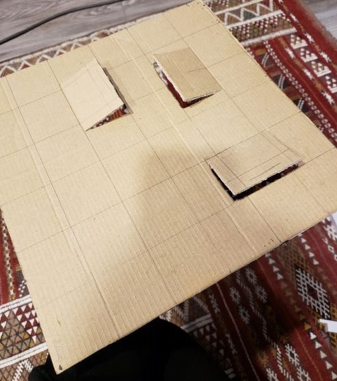
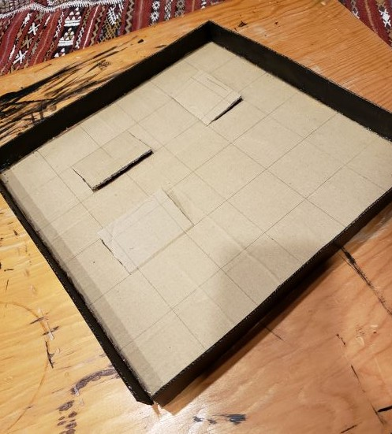
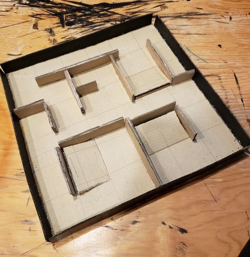
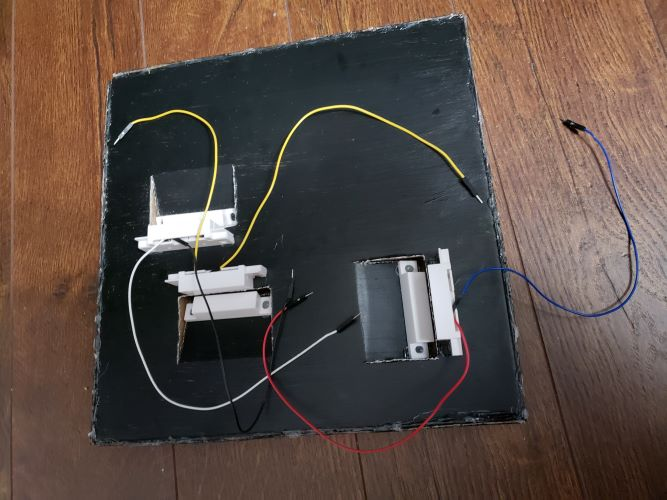

# Arduino Maze with Magnet Sensors

This project is an Arduino maze made out of cardboard. 
The main objective of the maze game is to roll a marble onto three different door-like flaps of the maze which have magets attached to them.
When a player successfully closes this flap a magnet sensor will sense the magnet attached to the flap. It will also turn on an LED to signal the successful close.

## Contents

* /hardware - list of hardware used 
* /images - images for how to build the project
* /Arduino_Maze - the file to run the project
* /LICENSE
* /README.md

## Materials

List of Materials Needed:

* Arduino Uno x1
* Breadboard x1
* SG90 Servo Motors x2
* joystick modulo x1
* magnetic contact door sensors x3
* Green LED x3
* 560 Ohms resistors x3
* marble x1
* wires
* screws x2
* hot glue gun and hot glue
* sharp blade knife

## Build

1. Design the dimensions for the cardboard pices as shown below.

Also make rectangular pieces that will be the walls inside the maze.
The 27cm x 27cm piece will be the base of the maze. 
The four 27cm x 2cm pieces will be the outer walls of the maze
The four 29cm x 4cm pieces will be the square that control the x-axis
The two large pieces with a base width of 24cm will be the left and right walls to hold up the maze.
Extra rectangular pieces can be cut out to serve as the walls inside the maze.

2. Plan out the areas where you want the magnetic sensors and magnets to go. 

Cut three lines so that the cardboard can lift up.

3. Begin hot gluing the pieces together. 

Glue the four 27cm x 2cm pieces to the walls of the maze

Glue the inner walls of the maze.

Glue the four 29cm x 4cm pieces together to form a square

4. Cut out a square large enough to fit a servo motor in the left wall and the top edge of the x-axis square. Then hot glue the servos into place.

5. Hot glue the motors spinners. One onto the left edge of the x-axis square, and the other on the top edge of the outer wall of the maze.

6. Wire the magnet sensors

7. Hot glue the magnets under the flap, and hot glue magnet sensors under the maze so that they are about 2cm away from the magnet when the flap is closed. 

8. Attach the x-axis square and maze so that the walls are holding them up.

9. Follow the schematic to set up the hardware. 

The result should look something like this

## Usage

Here's how to use the project:
1. Upload the provided code to the Arduino
2. Place the marble into your start position
3. begin moving the maze by using the joystick to move left, right, up, or down
4. try to get all the flaps pushed down. 
5. when a flap is successfully pushed down, an LED will light up
6. when all of the flaps are pushed down the game is completed

## Team 

Minna Roberto - created the entire project

## Credits

Ahmed Azouz - user on Arduino.cc who created the Arduino Marble Maze Labyrinth project, which was the base concept of this project (https://create.arduino.cc/projecthub/AhmedAzouz/arduino-marble-maze-labyrinth-bd9ea6)

Mert Arduino on YouTube. This user's code was a reference used for getting the joystick to move the servo motors. (https://www.youtube.com/watch?v=kA_pbMR6jVs)

